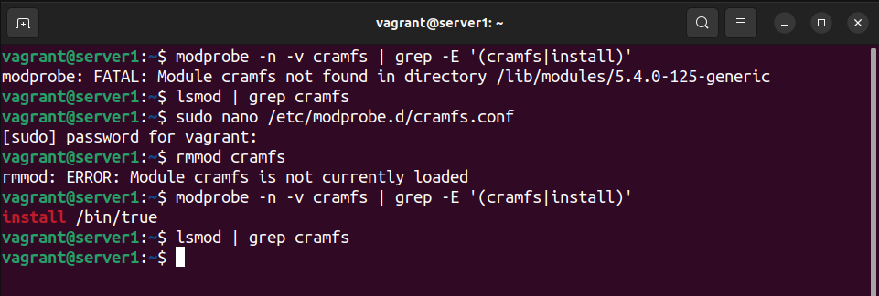
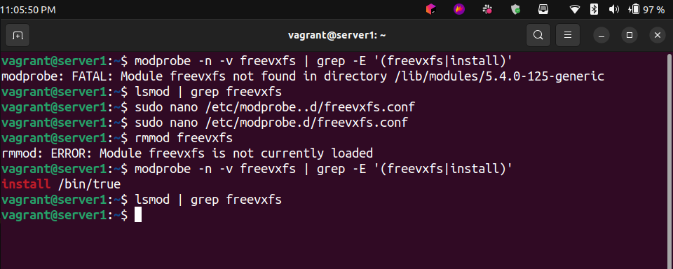
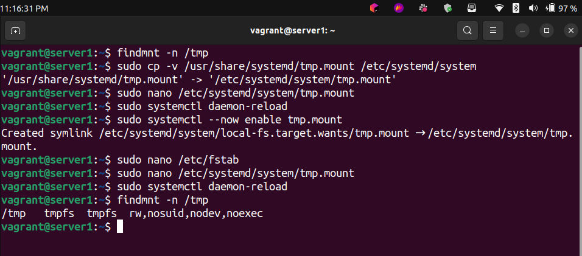
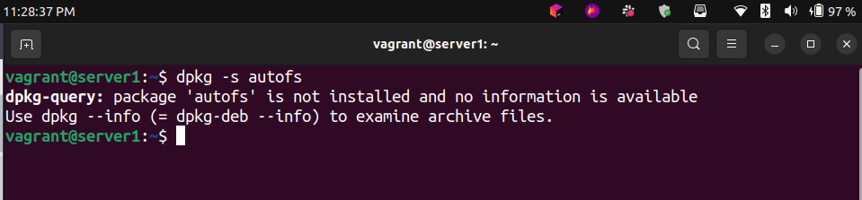
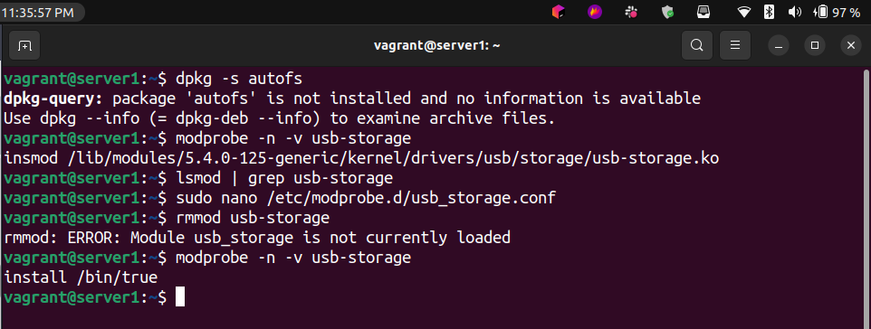
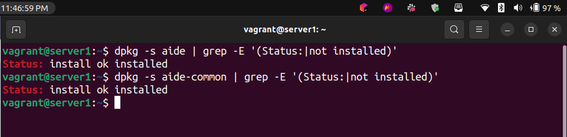
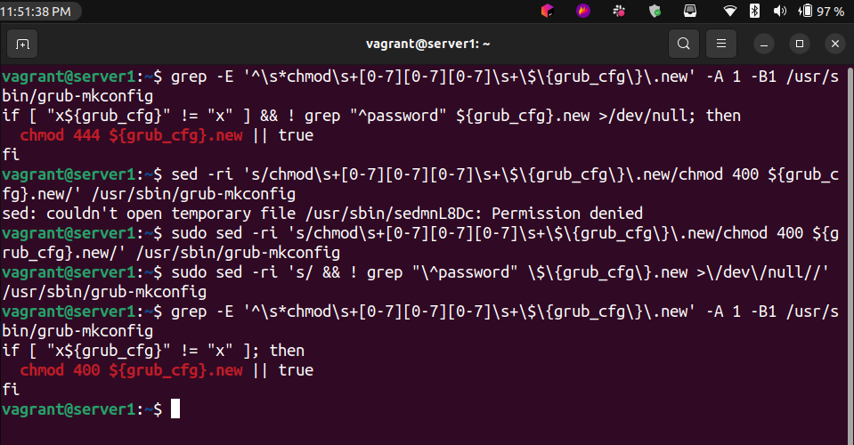
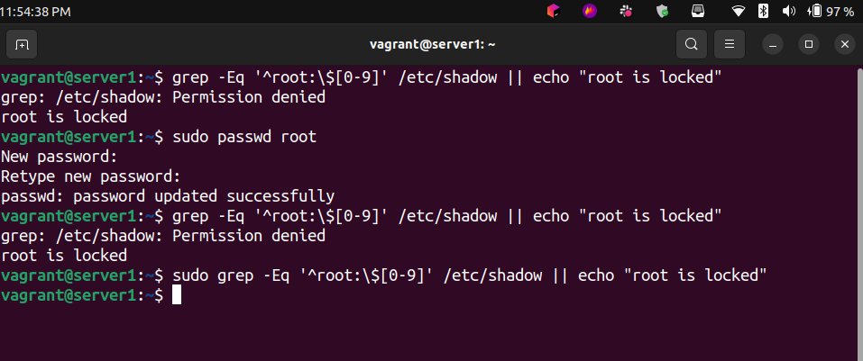
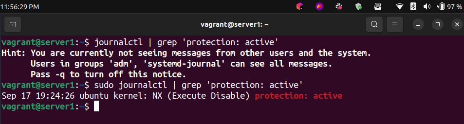
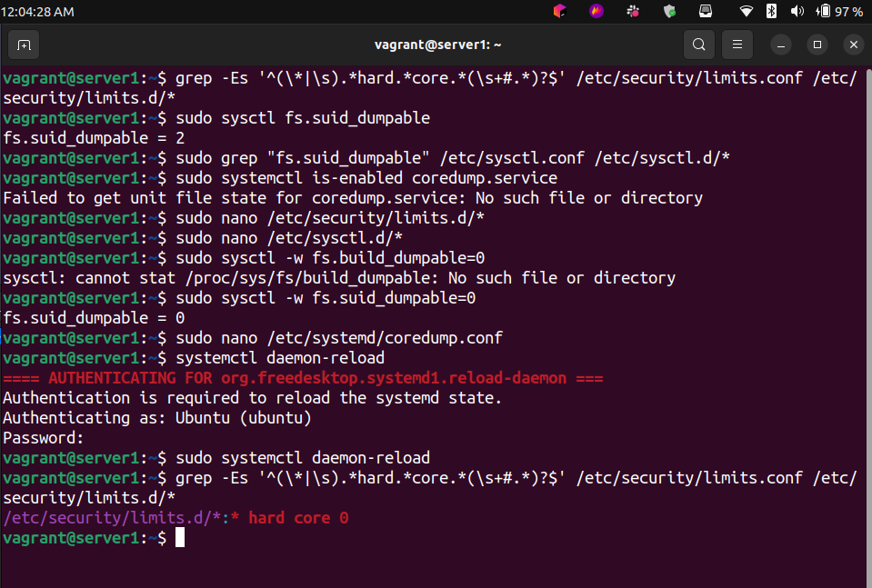

# **Setting CIS Benchmarks on Ubuntu 20.04 LTS**

 

### Disable cramfs filesystem mount

 

 

### Disable freevxfs filesystem mount

 

 

### Enable /tmp filesystem automount

 

 

### Disable automounting (autofs)

 

 

### Disable USB Storage

 

 

### Install AIDE

 

 

### Prevent overwriting bootloader permissions

 

 

### Enable single user mode authentication

 

 

### Enable XD/NX Support

 

 

### Restrict core dumps

 

 

