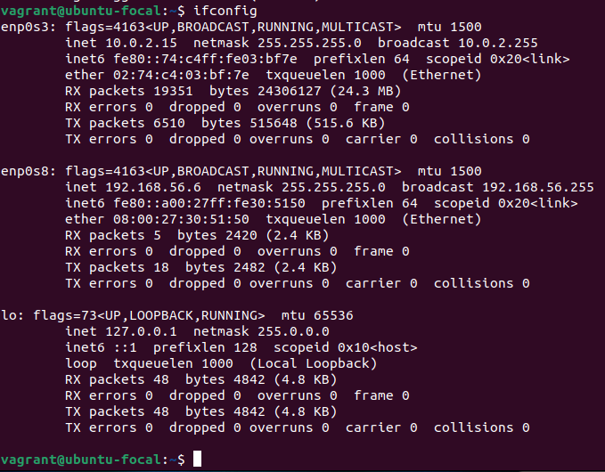

# **How I created a VM in vagrant on Linux**

### **Prerequisites**
- Virtualbox
- Virtualbox Extensions Pack
- Vagrant
- Linux Ubuntu 22.04 (Host Operating System)
- Switch from <code>Wayland</code> to <code>Ubuntu on Xorg</code>. This eliminates compatibility issues between Vagrant and Ubuntu.
- Enable virtualization in the system BIOS

### **How to install the VM**
<ol>
    <li>Install Virtualbox</li>
    <li>Install Virtualbox Extensions Pack</li>
    <li>Install Vagrant</li>
    <li>Create a folder to store a Vagrant VM and initialize Vagrant using <code>vagrant init ubuntu/focal64</code></li>
    <li>Start the VM using <code>vagrant up</code></li>
    <li>Connect to the VM using SSH: <code>vagrant ssh</code></li>
    <li>Install <code>net-tools</code> using <code>sudo apt install net-tools</code></li>
    <li>Run <code>ifconfig</code>. It should display the output of the network adapters.</li>
</ol>


```
vagrant@ubuntu-focal:~$ ifconfig
enp0s3: flags=4163<UP,BROADCAST,RUNNING,MULTICAST>  mtu 1500
        inet 10.0.2.15  netmask 255.255.255.0  broadcast 10.0.2.255
        inet6 fe80::74:c4ff:fe03:bf7e  prefixlen 64  scopeid 0x20<link>
        ether 02:74:c4:03:bf:7e  txqueuelen 1000  (Ethernet)
        RX packets 19351  bytes 24306127 (24.3 MB)
        RX errors 0  dropped 0  overruns 0  frame 0
        TX packets 6510  bytes 515648 (515.6 KB)
        TX errors 0  dropped 0 overruns 0  carrier 0  collisions 0

enp0s8: flags=4163<UP,BROADCAST,RUNNING,MULTICAST>  mtu 1500
        inet 192.168.56.6  netmask 255.255.255.0  broadcast 192.168.56.255
        inet6 fe80::a00:27ff:fe30:5150  prefixlen 64  scopeid 0x20<link>
        ether 08:00:27:30:51:50  txqueuelen 1000  (Ethernet)
        RX packets 5  bytes 2420 (2.4 KB)
        RX errors 0  dropped 0  overruns 0  frame 0
        TX packets 18  bytes 2482 (2.4 KB)
        TX errors 0  dropped 0 overruns 0  carrier 0  collisions 0

lo: flags=73<UP,LOOPBACK,RUNNING>  mtu 65536
        inet 127.0.0.1  netmask 255.0.0.0
        inet6 ::1  prefixlen 128  scopeid 0x10<host>
        loop  txqueuelen 1000  (Local Loopback)
        RX packets 48  bytes 4842 (4.8 KB)
        RX errors 0  dropped 0  overruns 0  frame 0
        TX packets 48  bytes 4842 (4.8 KB)
        TX errors 0  dropped 0 overruns 0  carrier 0  collisions 0

vagrant@ubuntu-focal:~$ 
```
<br />



