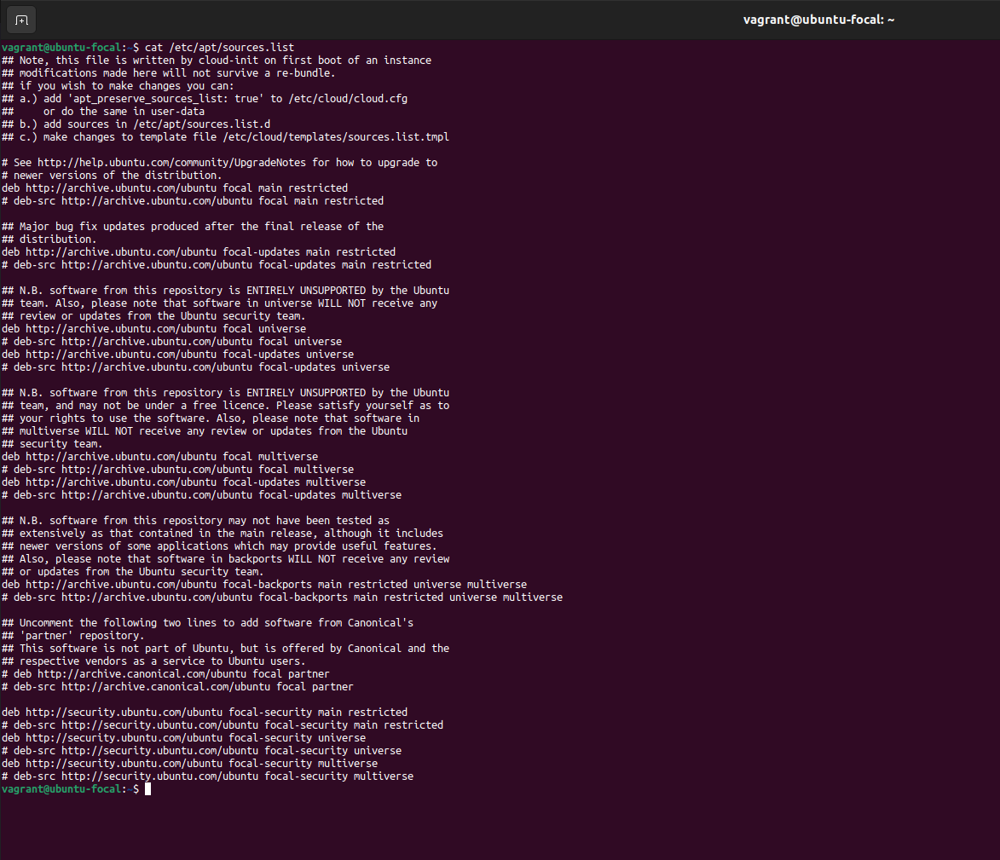
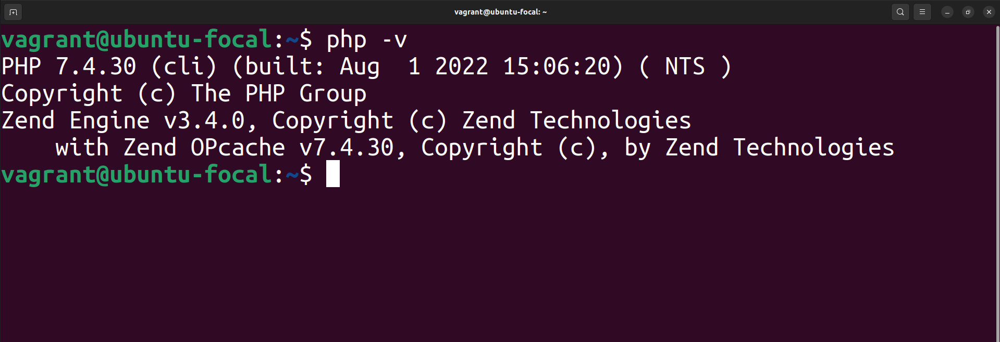

# Exercise 4 - Installing PHP 7.4

### Prerequisites
<ul>
    <li>PHP Dependency: <code>software-properties-common apt-transport-https</code></li>
</ul>

### Installation
 

**Step 1**
 
Install PHP dependency using <code>sudo apt install software-properties-common apt-transport-https -y</code>.
 

**Step 2**
 
Update linux apt source list using: <code>sudo apt update</code>
 

**Step 3**
 
Upgrade outdated packages using: <code>sudo apt upgrade</code>
 

**Step 4**
 
You can install PHP 7.4 alone using: <code>sudo apt install php-7.4</code>
 

Alternatively, you can install PHP 7.4 and it's modules using: <code>sudo apt install -y php7.4 php7.4-common php7.4-mysql php7.4-xml php7.4-xmlrpc php7.4-curl php7.4-gd php7.4-imagick php7.4-cli php7.4-dev php7.4-imap php7.4-mbstring php7.4-opcache php7.4-soap php7.4-zip php7.4-intl php7.4-bcmath</code>
 

### **APT SOURCES OUTPUT**
 

 

### **PHP Version**
 
