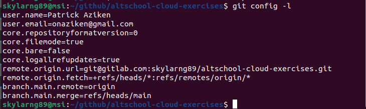
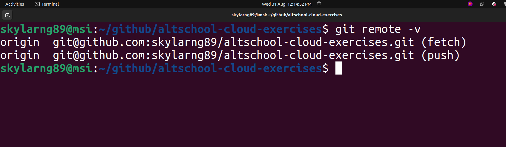
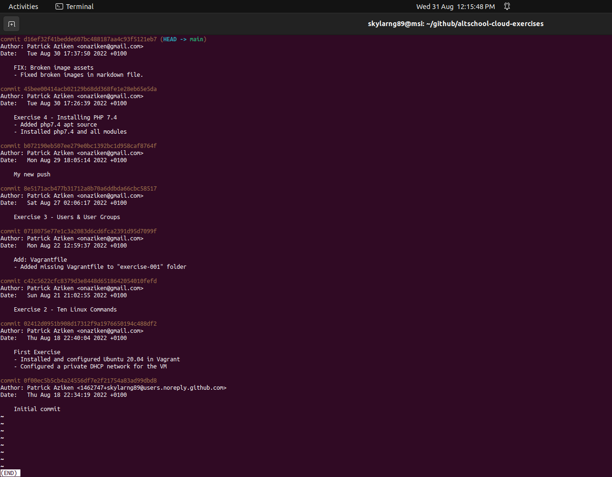

# Exercise 5 - Git Terms
     

### Prerequisites
- Install Git
- "altschool-cloud-exercises" git repo
     

In the **"exercise-005"** folder, there are three images showing the git commands run inside of the _"altschool-cloud-exercises"_ project.
     

1) **git config -l**
     

     

2) **git remote -v**
     

     

3) **git log**
     

     

