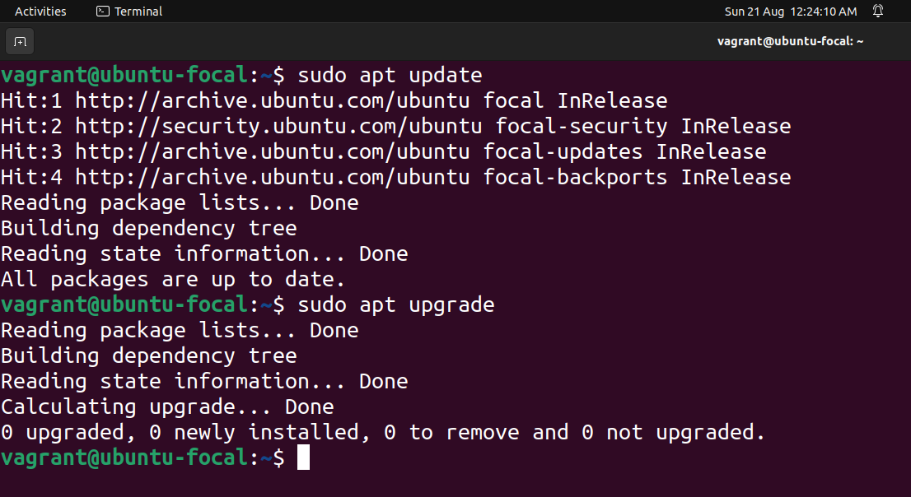
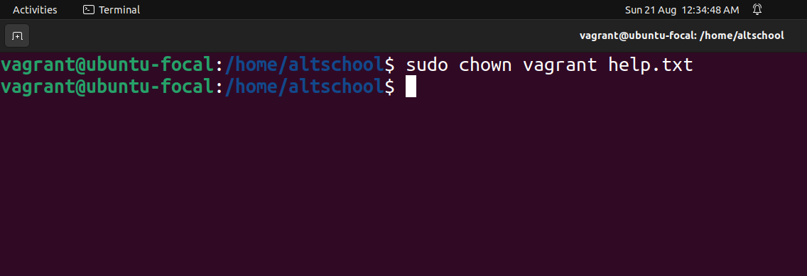
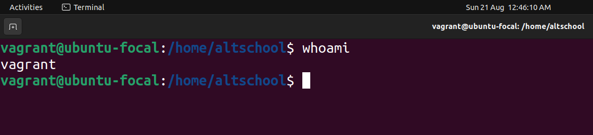
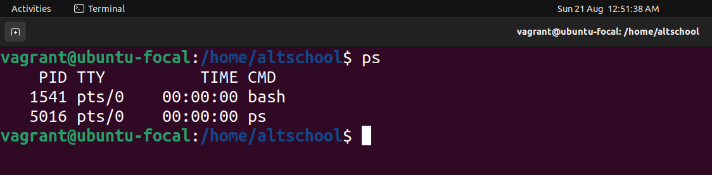
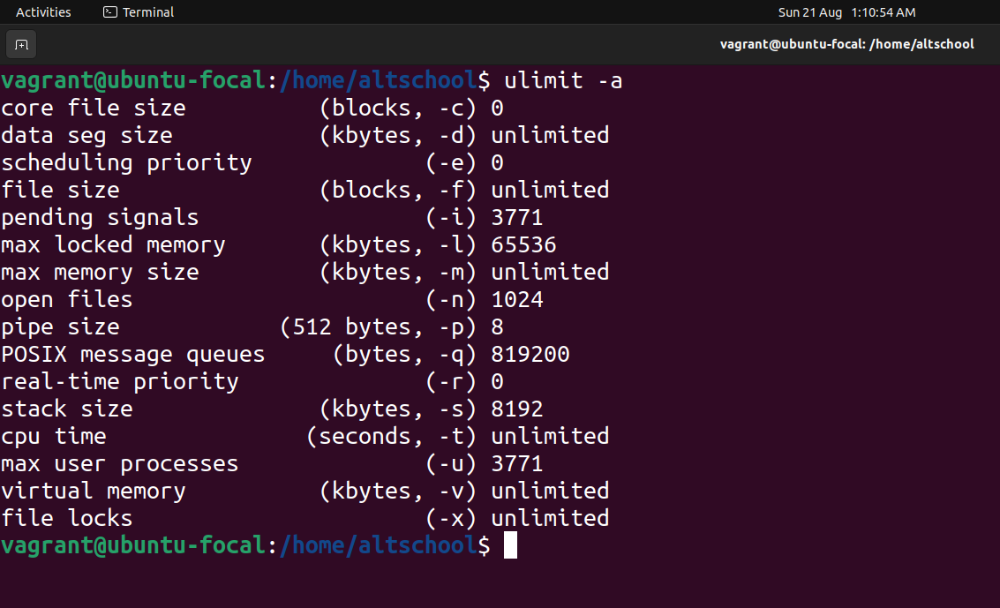
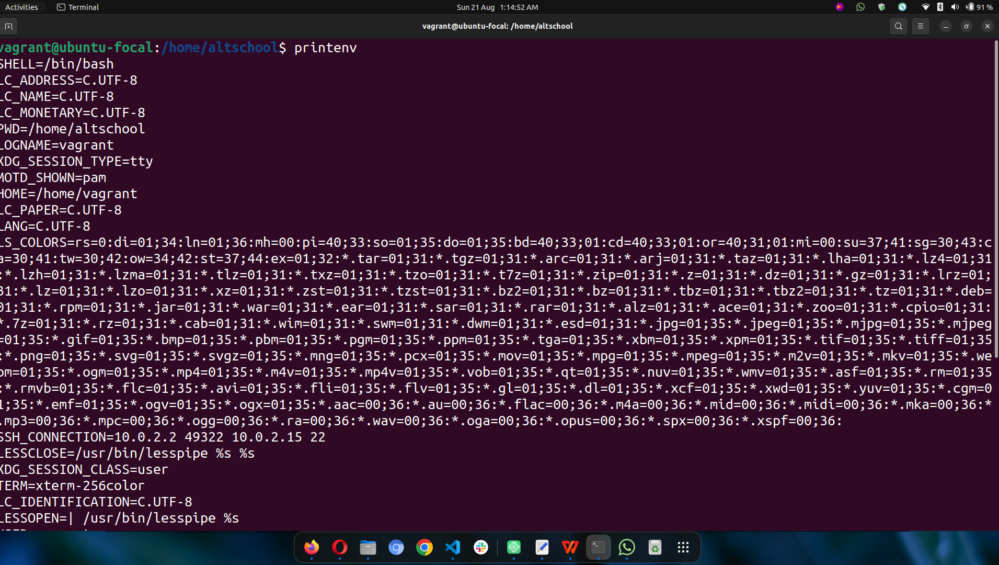
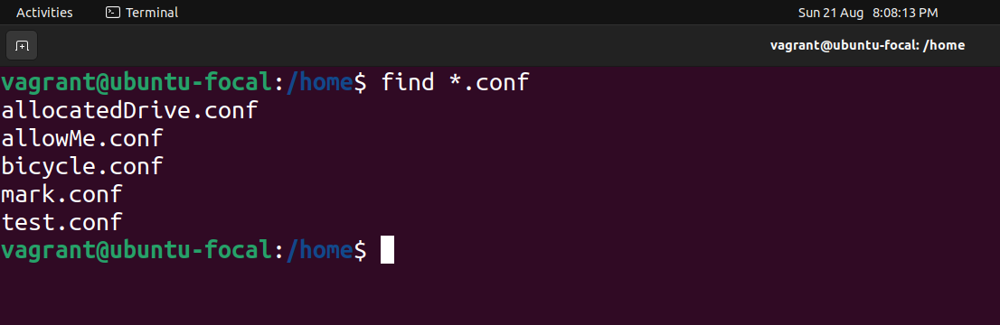
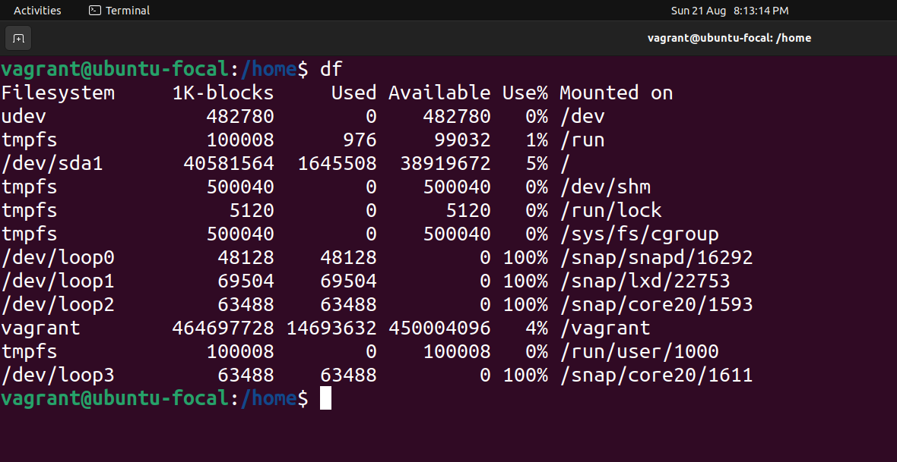
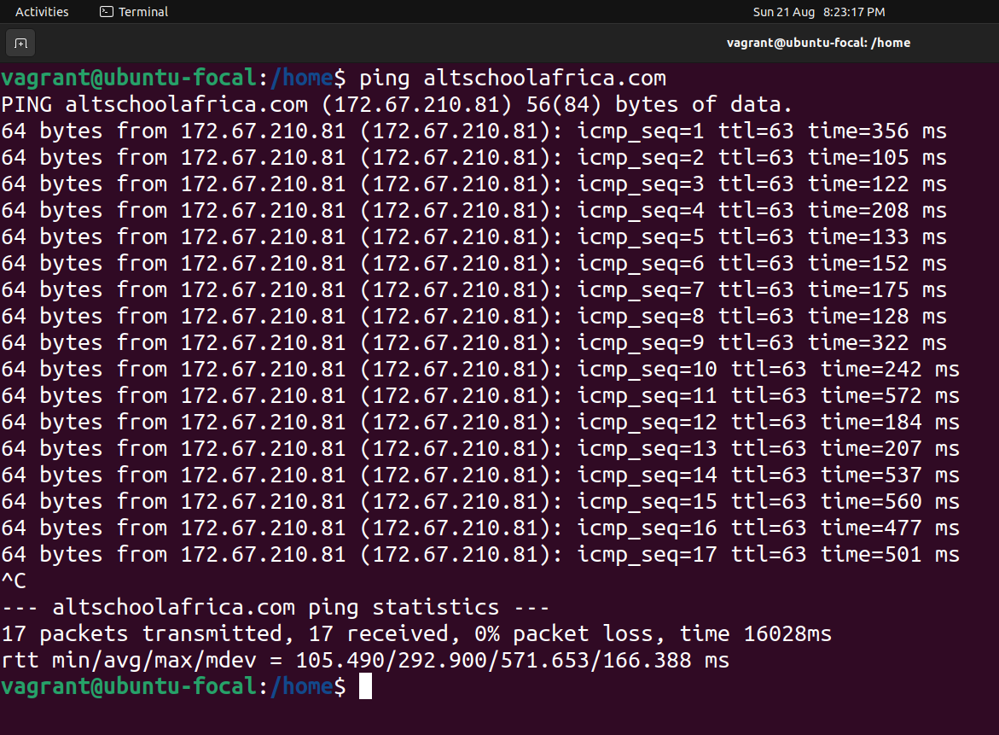
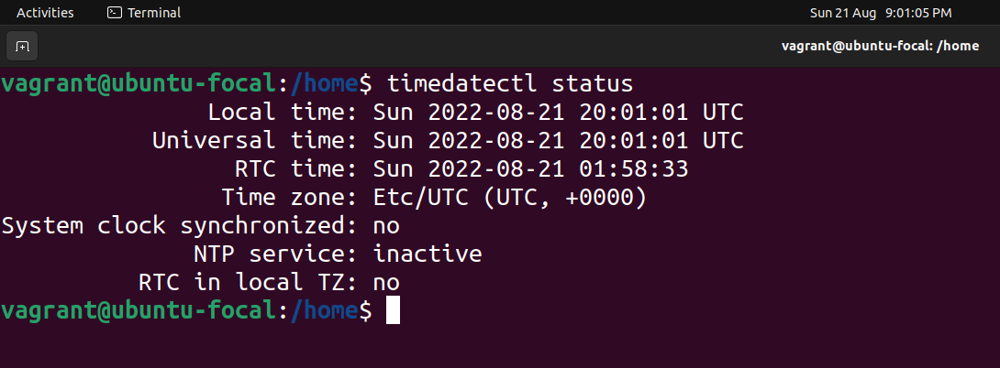

# **Exercise 2 - Linux Commands**

### 1) **sudo** 
The <code>sudo</code> command is used to execute an action as another user, typically with elevated (Admin) privileges.

 

 

### 2) **chown**  
The <code>chown</code> command is used to change the ownership of a file to a new user/group

 

 

### 3) **whoami**:  
The <code>whoami</code> command is find the identity of the current logged in user.

 

 

### 4) **ps**  
The <code>ps</code> command is used to show a list of running processes.

 

 

### 5) **ulimit**  
The <code>ulimit</code> command is used to show the resource limits of the current user.

 

 

### 6) **printenv**  
The <code>printenv</code> command is used to print the list of all environment variables.

 

 

### 7) **find**  
The <code>find</code> command is used to search for something in the filesystem.

 

 

### 8) **df**  
The <code>df</code> command is used display the disk space on the system.

 

 

### 9) **ping**  
The <code>ping</code> command is used to check the network connectivity between two nodes.

 

 

### 10) **timedatectl**  
The <code>timedatectl</code> command is used to control and set the time and date on a Linux machine.

 

 