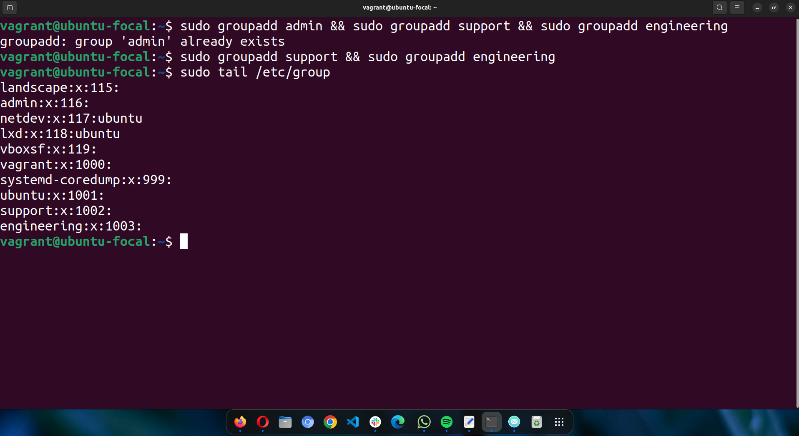
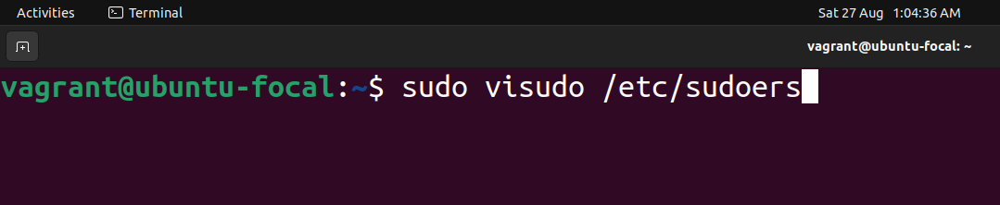
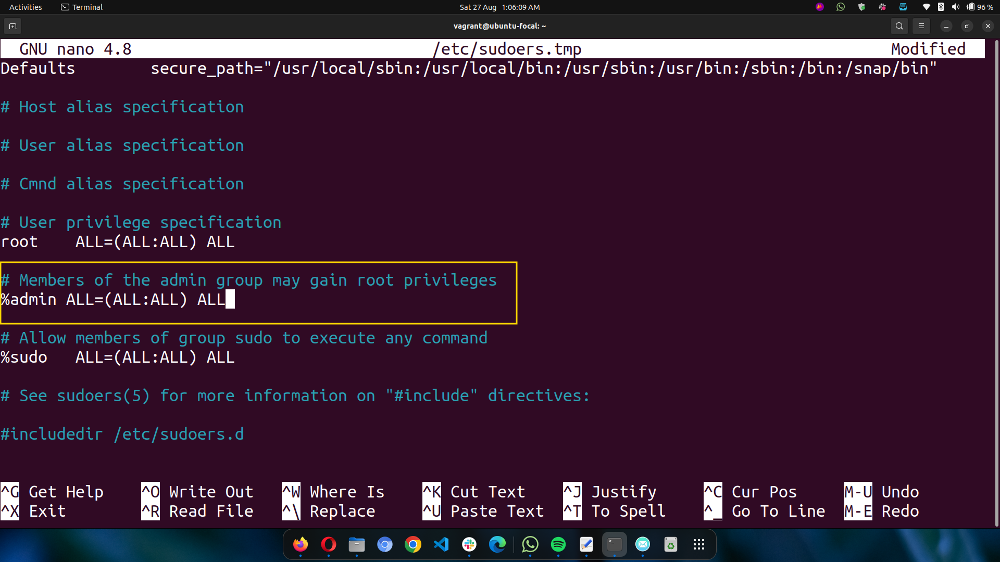
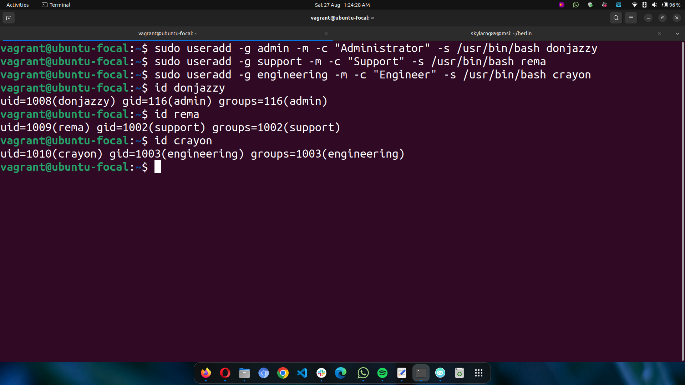
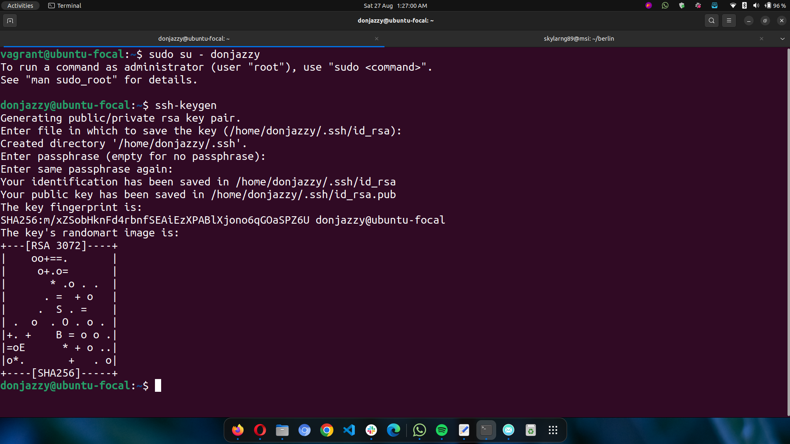
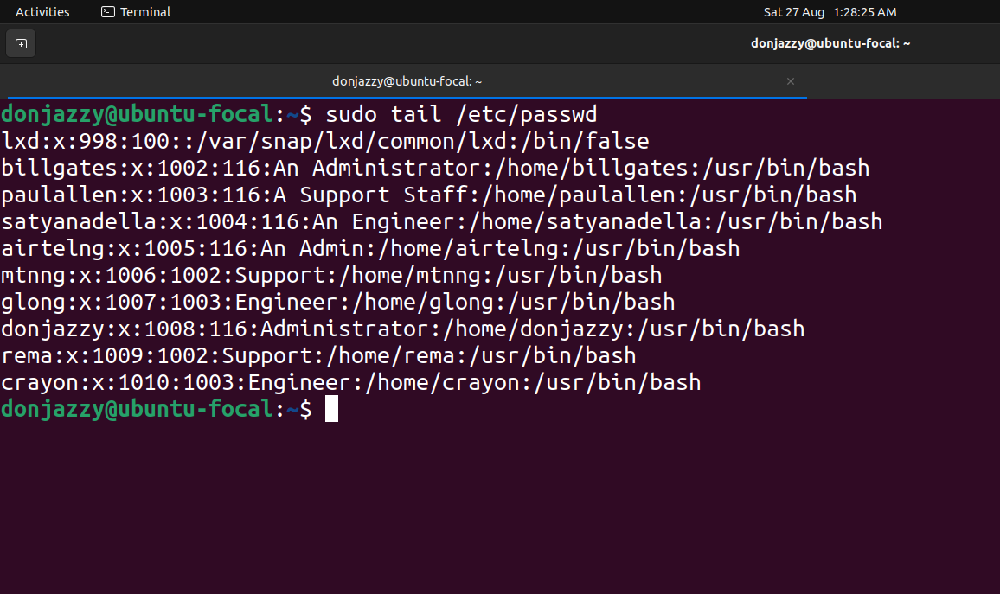
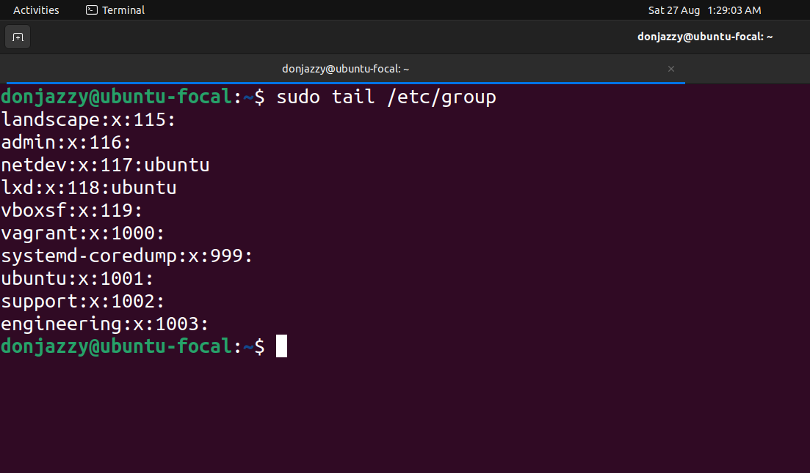
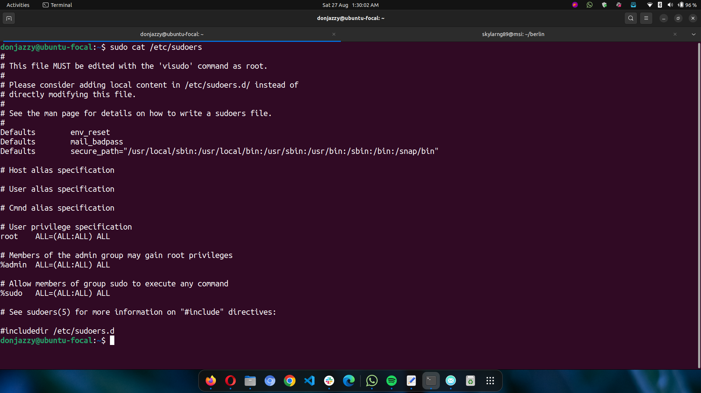

# **Users and User Groups**

### **Create user groups**

 

### **Add usergroup "admin" to sudoers**

 

### **Create users for each group**

 

### **Generate SSH key for Admin user**

 

### **/etc/passwd**

 

### **/etc/group**

 

### **/etc/sudoers**
