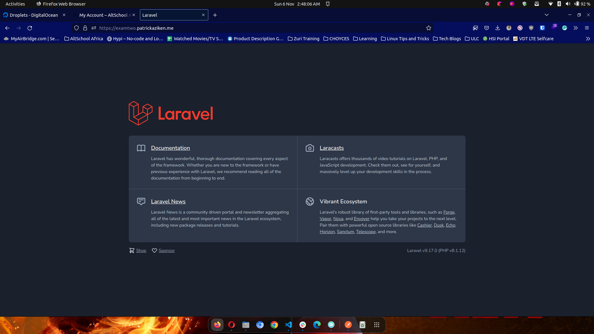

# Second Semester Exam - Ansible
 

## Tasks 
1. Deploy Laravel App using Ansible. [View Playbook](playbook.yaml).
2. Deploy PostgreSQL using Bash and execute it using Ansible. [View Script](pgsql.sh)
  

### Resource Stats 
- Digital Ocean
  - Region: London 1
  - CPU: 1 Intel Premium vCPU
  - Storage: 25GB SSD
  - RAM: 1GB
  - IPv4: 161.35.169.57
  - IPv6: 2a03:b0c0:1:d0::11a6:d001
  - Private IP: 10.106.0.3
  - Operating System: Ubuntu 20.04 (LTS) x64
  - SSL Issuer: Let's Encrypt
  

#### Deployment Preview - [View Online](https://examtwo.patrickaziken.me)
 

 
 

### SSH Keys 
- [Public Key](./ssh_keys/public_key)
- [Private Key](./ssh_keys/private_key)
 
 

### Networking Overview
 

 
 

 
 

### Digital Ocean Droplets 

- Mini Project (node1.patrickaziken.me)
- Semester Two Exam (node2.patrickaziken.me) 

